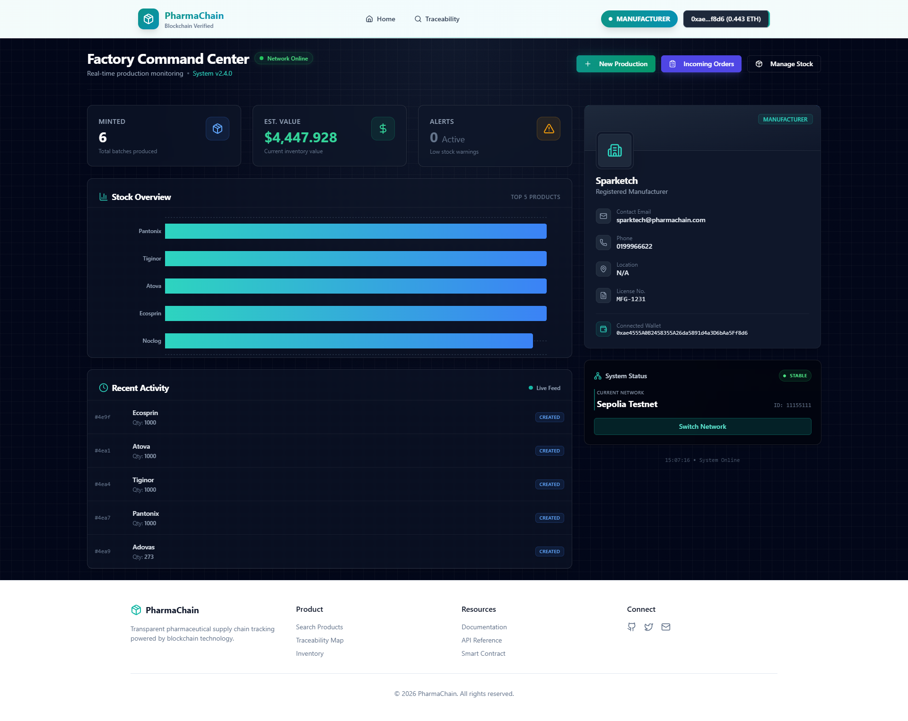
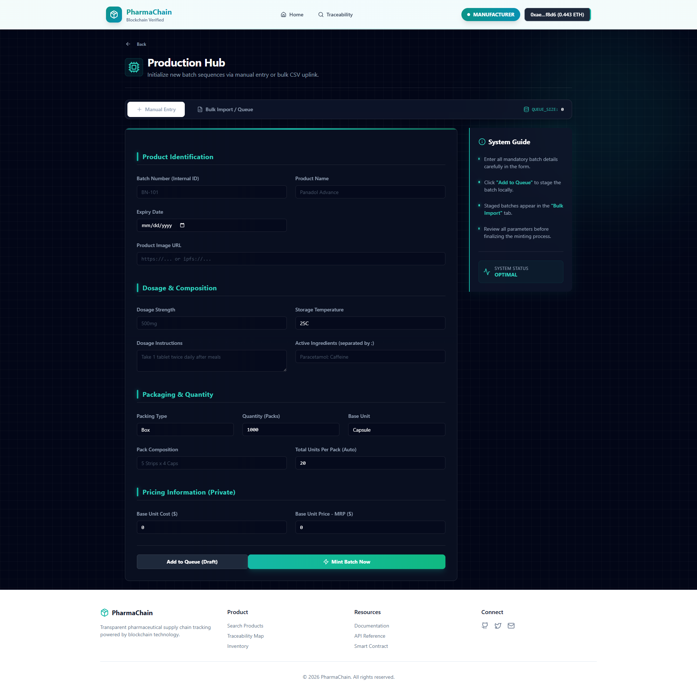
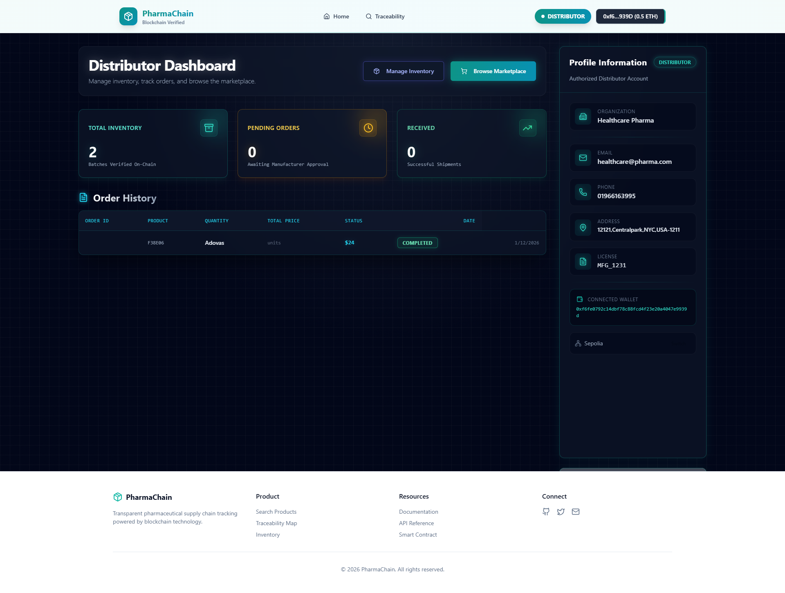
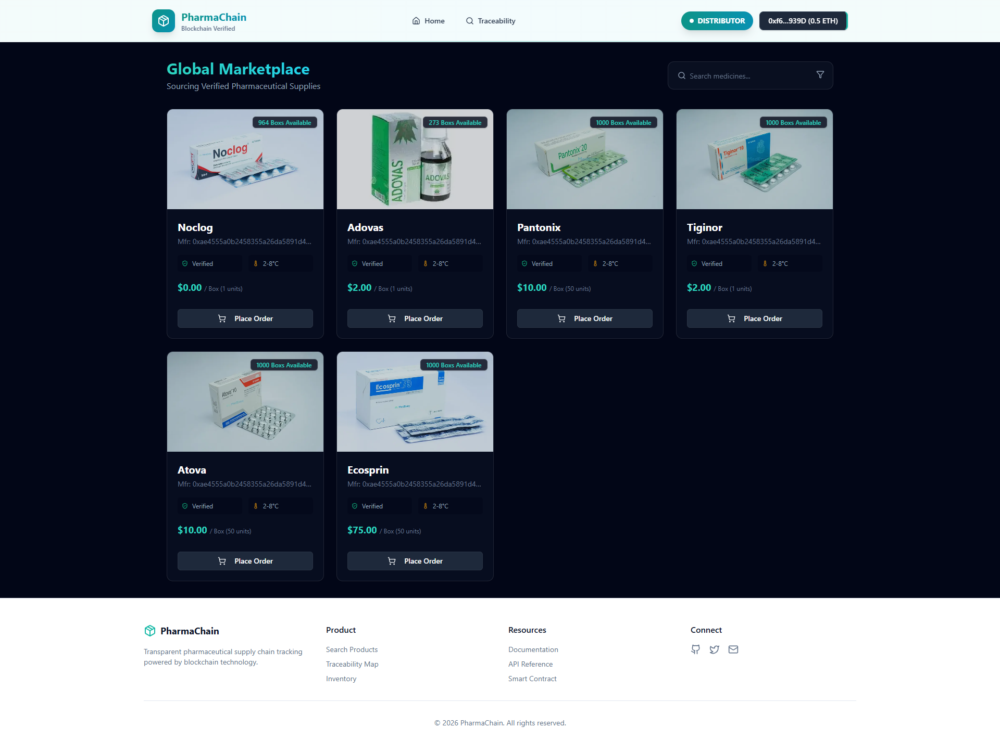
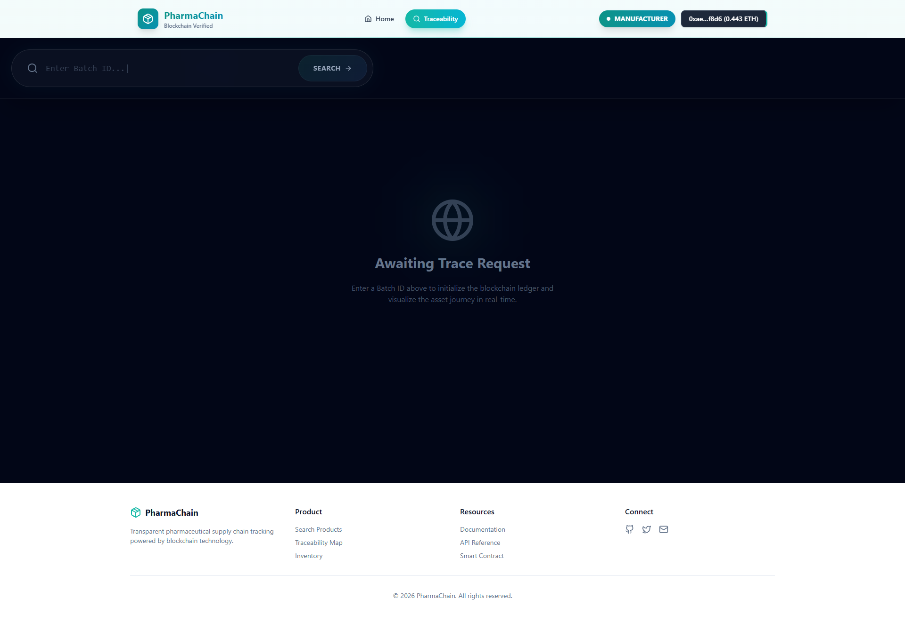
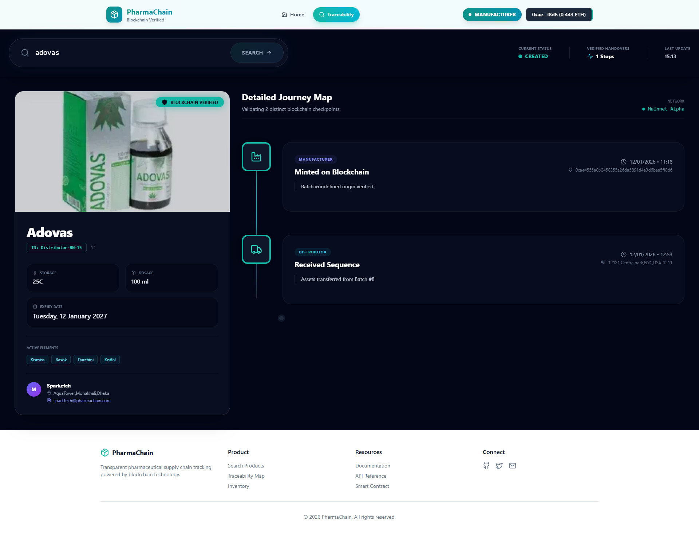
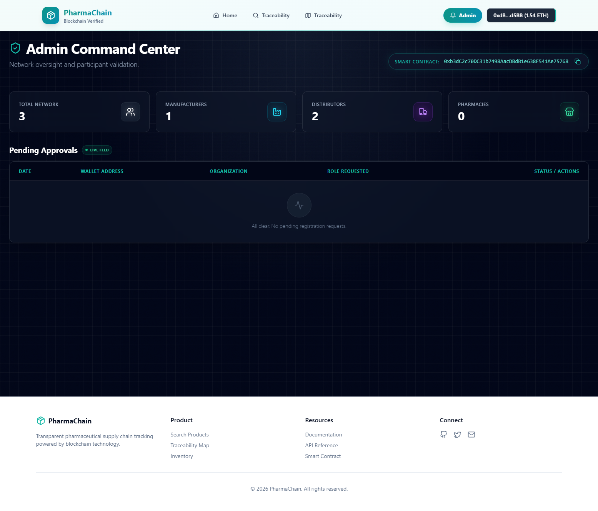

# PharmaChain 💊⛓️

**Enterprise-grade Pharmaceutical Supply Chain Management System**


PharmaChain is a revolutionary decentralized application (dApp) designed to bring transparency, security, and traceability to the pharmaceutical supply chain. By leveraging Ethereum blockchain technology, it ensures that every step of a medicine's journey—from manufacturing to the end consumer—is immutable, verifiable, and tamper-proof.

---

## 🌟 Key Features

### 🏭 For Manufacturers
- **Batch Creation**: Securely create medicine batches with comprehensive metadata (name, quantity, expiry, chemical composition).
- **Inventory Management**: Real-time tracking of manufactured stock.
- **Bulk Operations**: Efficiently handle large datasets with bulk entry capabilities.

<div style="display: flex; gap: 10px;">
  
  
</div>

### 🚚 For Distributors & Logistics
- **Marketplace**: Browse and order verified medicines directly from manufacturers.
- **Global Orders**: Manage incoming orders and shipments seamlessly.
- **Visual Validation**: Verify product authenticity before acceptance.

<div style="display: flex; gap: 10px;">
  
  
</div>

### 🔍 Advanced Traceability
- **Visual Journey Map**: Interactive timeline showing the complete history of a medicine batch.
- **Geo-Tagging**: Visualize supply chain movement on a map.
- **DNA Profile**: Detailed "Asset DNA" including transaction hashes and block timestamps.

<div style="display: flex; gap: 10px;">
  
  
</div>

### 🛡️ Admin & Security
- **Role-Based Access Control (RBAC)**: secure management of authorized entities (Manufacturers, Distributors, Pharmacies).
- **System Oversight**: Comprehensive dashboard for system health and network stats.



---

## 🛠️ Technology Stack

### Blockchain (Smart Contracts)
- **Solidity**: Core contract logic.
- **Hardhat**: Development environment, testing, and deployment.
- **OpenZeppelin**: UUPS Upgradeable proxy pattern for future-proof contracts.
- **Sepolia Testnet / Localhost**: Supported networks.

### Frontend
- **React 19**: Modern UI library.
- **Vite**: Ultra-fast build tool.
- **TailwindCSS**: Utility-first styling for a premium design.
- **Framer Motion**: Smooth animations and transitions.
- **RainbowKit & Wagmi**: Best-in-class wallet connection and Web3 hooks.
- **Ethers.js / Viem**: Blockchain interaction.

---

## 🚀 Getting Started

Follow these steps to set up the project locally.

### Prerequisites
- **Node.js** (v18+)
- **MetaMask** browser extension

### Installation

1. **Clone the repository**
   ```bash
   git clone https://github.com/yourusername/aphelion-mariner.git
   cd aphelion-mariner
   ```

2. **Install Dependencies**
   ```bash
   npm install
   
   # Install frontend dependencies
   cd frontend
   npm install
   ```

### ⚙️ Environment Configuration

Create a `.env` file in the root directory (based on `.env.example`):

```env
PRIVATE_KEY=your_private_key
SEPOLIA_RPC_URL=https://eth-sepolia.g.alchemy.com/v2/YOUR_KEY
ETHERSCAN_API_KEY=your_etherscan_key
```

---

## 🏃‍♂️ Running the Application

### 1. Start the Local Blockchain
Open a terminal and start the Hardhat node:
```bash
npm run node
```
*Ref: Hardhat Network running on `http://127.0.0.1:8545` (Chain ID: 31337)*

### 2. Deploy Smart Contracts
In a second terminal, deploy the contracts to the local network:
```bash
npm run deploy:localhost
```
*Note down the **Proxy Address** from the output.*

### 3. Configure MetaMask
- **Add Network**: 
  - RPC URL: `http://127.0.0.1:8545`
  - Chain ID: `31337`
  - Currency: `ETH`
- **Import Account**: Use one of the private keys provided by `npm run node`.

### 4. Start the Frontend
In a third terminal:
```bash
cd frontend
npm run dev
```
Open `http://localhost:5173` in your browser.

---

## 📖 Deployment Guide

For deploying to public testnets like Sepolia, please refer to the extensive [DEPLOYMENT.md](DEPLOYMENT.md) guide included in this repository.

It covers:
- Setup for Sepolia Testnet
- Contract Verification on Etherscan
- Upgrading contracts using UUPS pattern

---

## 🤝 Contributing

Contributions are welcome! Please feel free to submit a Pull Request.

## 📄 License

This project is licensed under the ISC License.
